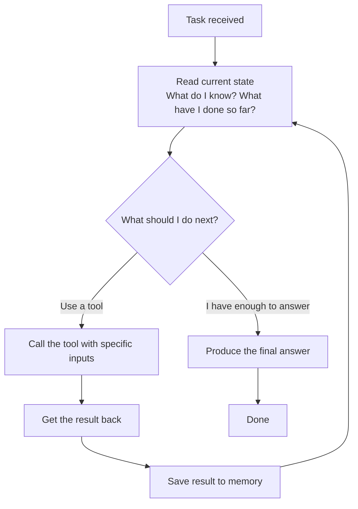

# What Is an Agent?

---

You have used AI before. You type something, it replies. Simple.

But have you noticed — you are always the one deciding what to ask next? You read the answer, figure out what is still missing, and decide the next question. The AI just responds. It never takes the next step on its own.

Now imagine you are planning a trip. You need to check flight prices, compare hotels, figure out the best dates based on weather, and see if any local events are happening that week. With a regular AI, you ask one question at a time. You do the connecting. You open the tabs. You compare. You decide.

An agent does all of that for you. You just say: *"Plan a 4-day trip to Tokyo in March, budget $1,500."* And it goes — searching, reading, comparing, deciding — and comes back with a complete plan.

That is the difference.

---

## A Regular AI vs an Agent

A regular AI model works like a **vending machine**. You press a button, you get one thing out. Press again, get another thing. Each press is independent. The machine does not remember your last choice or decide what you might want next.

An agent works like a **personal assistant**. You give them a goal — not a single question, a goal. They go figure out the steps. They check what they need. They come back and check more if required. They keep going until the job is done. And they do it without you managing every move.

The key difference is this one word: **decides**.

A regular AI responds. An agent decides — what to do next, what to look up, when it has enough to answer, when to stop.

---

## What Is Inside an Agent

Every agent — no matter what it is built with — has exactly four parts working together.

### 1. The Language Model — The Brain
This is the language model. It reads the situation and decides what to do next. That is all it does. It does not search anything, open anything, or run anything by itself. It only thinks and produces an instruction. Like a manager sitting at a desk who never leaves their chair — they just read reports and write instructions for others to carry out.

### 2. Tools — The Hands
These are the tools. Searching the web, reading a file, running a calculation, calling an API. The brain tells the hands what to do. The hands actually do it and bring the result back. Without hands, the brain can only think but never act.

### 3. Memory — The Notepad
This is memory. Every time a tool returns a result, the agent writes it down. The next time it thinks, it reads the notepad first. Without a notepad, every step starts from scratch with no memory of what just happened — like waking up every few seconds with no idea where you are.

### 4. The Planning Loop — The Cycle
This is the engine that ties everything together.



The loop runs over and over. Each time around:
- The agent reads what it knows so far
- Decides the next action
- Takes that action
- Stores the result
- Goes around again

It stops when the agent decides it has enough to give a final answer — or when it hits a maximum number of steps.

This loop is what makes an agent different from a regular LLM call. A regular call happens once. An agent loops as many times as the task requires.


---

## Watching It Work

Someone asks an agent: *"What is the best laptop under $700 for coding right now?"*

**Loop 1** — Brain thinks: *I need current options. My training data is months old — prices change. I will search.* Hands search the web. Results come back: five laptops in that range. Written on the notepad.

**Loop 2** — Brain reads the notepad and thinks: *I have options but I need to know which ones actually handle coding well — RAM and processor matter most.* Hands search for performance comparisons. Results come back. Written on the notepad.

**Loop 3** — Brain reads the notepad and thinks: *I have a strong candidate. Let me verify the price is current and it is actually in stock.* Hands check a shopping site. Price confirmed, in stock. Written on the notepad.

**Loop 4** — Brain reads everything and thinks: *I have what I need.* It produces the answer.

```
"The best option right now is the Acer Aspire 5 (Ryzen 5, 16GB RAM) 
at $649. It handles multiple apps simultaneously without slowdown — 
important when running a code editor, browser, and local server at 
the same time. It is in stock at major retailers."
```

Four loops. Three searches. One specific, verified answer.

A regular AI would have said: *"I would recommend looking at the Lenovo IdeaPad or Acer Aspire series for your budget."* Vague. Possibly outdated. No stock check. No reasoning about what coding specifically needs.

The agent went and found out. The regular AI guessed.

---

## The One Thing to Remember

An agent is not a smarter chatbot. It is a system with a brain that thinks, hands that act, a notepad that remembers, and a loop that keeps going — until the job is actually done.

---

## Quick Recap

- A regular AI responds to one question at a time — an agent receives a goal and figures out the steps on its own
- Every agent has four parts: Brain (thinks), Hands (acts), Notepad (remembers), Loop (keeps it going)
- The brain never acts directly — it only thinks and instructs; the hands carry out the actual work

---

## What Is Next

The brain — the language model — is doing the thinking in every loop. But how exactly does it think before it acts? That structured way of reasoning has a name, and it is what separates agents that work reliably from ones that go wrong. That is what the next file covers.
