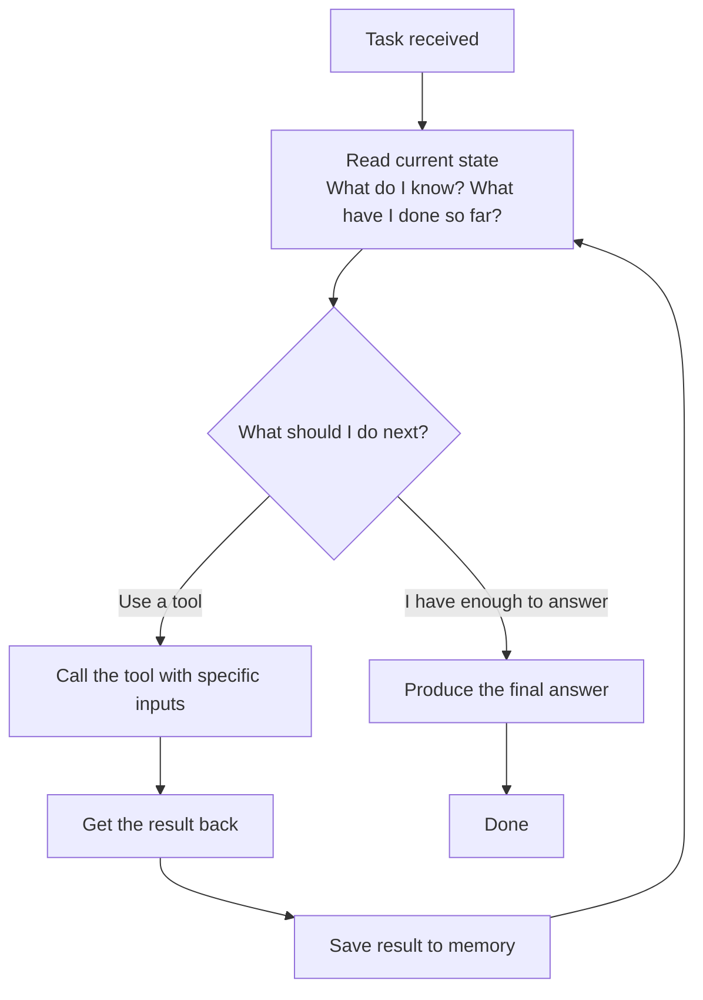

# Agents — LLM + Memory + Tools + Planning Loop

---

## Learning Objectives

By the end of this file you will be able to:

- Explain what an AI agent is and how it is different from a regular AI chat
- Name the four things every agent is made of and say what each one does
- Trace what happens inside an agent from the moment it gets a task to the moment it finishes
- Explain why some tasks need an agent and others do not

---

## What Problem Are We Solving?

Imagine you ask an AI model this:

> "My flight to Delhi is tomorrow morning at 6am. What time should I leave home if I live in Koramangala, Bangalore?"

A smart model will give you a reasonable answer — something like "leave by 3am to be safe." But here is the problem: **it is guessing.** It does not know current traffic conditions. It does not know if there is a bandh tomorrow. It does not know if your specific terminal is domestic or international. It is producing a plausible answer from training data, not from real information.

Now imagine a system that actually:

1. Looks up tomorrow's traffic from Koramangala to Kempegowda Airport on a live map
2. Checks which terminal IndiGo flights depart from
3. Reads the airport's recommendation for domestic check-in time
4. Adds everything up and gives you a specific, verified answer

That second system is an **agent**. The difference is not that the agent is smarter. The difference is that the agent can **go and get real information** and **take real actions** — instead of generating a plausible-sounding answer from memory.

---

## What an Agent Actually Is

Here is the simplest definition:

> **An agent is an AI system that can use tools to take actions in the world, and decides for itself what actions to take — step by step — until a task is complete.**

Every AI model you have used so far works like this: you ask, it answers, done. One round. One shot.

An agent works like this: you give it a goal, and it figures out the steps. It might need to search for something first. Then read what it found. Then calculate something. Then check one more thing. It keeps going — deciding at each step what to do next — until the job is done.

The key word is **decides**. The agent is not following a script you wrote. It is figuring out the script as it goes.

---

## The Four Things Every Agent Is Made Of

No matter what tool, framework, or language model is used to build an agent — every agent has exactly four components. Learn these and you can understand any agent you encounter.

### 1. The Language Model — The Brain

The language model is the part that **thinks and decides**. It reads the situation — what is the task, what has happened so far, what tools are available — and decides what to do next.

It does not search the web. It does not run code. It does not call APIs. It **only produces text** that describes what should happen next. Something else — the agent framework — reads that text and actually does the thing.

Think of it like a manager who gives instructions but does not do the physical work themselves.

### 2. Memory — The Notepad

Every time the agent does something — searches for information, runs a calculation, calls a service — it needs to remember the result. Otherwise the next step has no idea what happened in the previous one.

There are two kinds of memory:

**In-context memory** is like RAM — fast, immediately available, but limited and temporary. Everything in the current conversation is in-context memory. Once the session ends, it is gone.

**External memory** is like a hard drive — slower to access, but it can store much more and it persists. This could be a database, a file, or a vector store. The agent retrieves what it needs when it needs it.

Most simple agents only use in-context memory. More sophisticated agents combine both.

### 3. Tools — The Hands

Tools are the only way an agent can do anything beyond generating text.

A tool is a function that the agent can call. Each tool has:
- A **name** — how the agent refers to it
- A **description** — what it does, written in plain English so the language model can understand when to use it
- A **schema** — what inputs it expects and what it returns

Here are some typical tools:

| Tool | What it does |
|---|---|
| `search_web` | Searches the internet and returns results |
| `read_file` | Opens a file and returns its contents |
| `run_code` | Executes code and returns the output |
| `call_api` | Makes an HTTP request and returns the response |
| `send_email` | Sends an email to a specified address |
| `query_database` | Runs a database query and returns matching rows |

The language model reads the tool descriptions and decides which tool to use. It then produces a structured instruction — "call this tool with these inputs." The framework picks that up and runs the actual function. The result comes back. The agent reads it and decides what to do next.

### 4. The Planning Loop — The Cycle

This is the engine that ties everything together.



The loop runs over and over. Each time around:
- The agent reads what it knows so far
- Decides the next action
- Takes that action
- Stores the result
- Goes around again

It stops when the agent decides it has enough to give a final answer — or when it hits a maximum number of steps.

This loop is what makes an agent different from a regular LLM call. A regular call happens once. An agent loops as many times as the task requires.

---

## Worked Example — Flight Check-In Time

Let us trace through the airport example step by step.

**Task given to the agent:**
> "My IndiGo flight to Delhi is tomorrow at 6am from Bangalore. I live in Koramangala. What time should I leave home?"

The agent has three tools: `search_web`, `get_live_traffic`, and `calculate`.

---

**Loop — Round 1**

The agent reads the task and thinks: *"I need to know which terminal IndiGo uses at Kempegowda Airport."*

```
Tool called: search_web
Input: "IndiGo terminal Kempegowda International Airport Bangalore"
Result: "IndiGo operates from Terminal 2 at KIAL."
```

Result saved to memory. Back to the top of the loop.

---

**Loop — Round 2**

The agent reads the task + memory and thinks: *"I know the terminal. Now I need to know how long the drive takes tomorrow morning."*

```
Tool called: get_live_traffic
Input: "Koramangala to KIAL Terminal 2, tomorrow 3am"
Result: "Estimated travel time: 45 minutes with low early-morning traffic."
```

Result saved to memory. Back to the top of the loop.

---

**Loop — Round 3**

The agent reads everything and thinks: *"I have the terminal and the travel time. Now I need to calculate when to leave — the flight is at 6am, domestic check-in closes 45 minutes before departure, I need time to get through security."*

```
Tool called: calculate
Input: "06:00 minus 45 minutes check-in buffer minus 45 minutes drive minus 15 minutes buffer"
Result: "04:15"
```

Result saved to memory. Back to the top of the loop.

---

**Loop — Round 4**

The agent reads everything and thinks: *"I have all the information I need. I can answer now."*

```
Final answer:
"Your IndiGo flight departs from Terminal 2 at KIAL. Based on current 
traffic estimates, the drive from Koramangala takes around 45 minutes 
at that hour. With the 45-minute domestic check-in cutoff and a small 
buffer, you should leave home by 4:15am."
```

Loop ends.

---

This is what a single LLM call cannot do. A single call would estimate the travel time, guess the terminal, and produce a confident-sounding answer with no real information behind it. The agent checked, calculated, and answered from actual data.

---

## When Do You Need an Agent vs a Simple LLM Call?

Not every task needs an agent. An agent adds complexity — more steps, more cost, more things that can go wrong. Use one only when the task actually requires it.

| Use a simple LLM call when... | Use an agent when... |
|---|---|
| The answer exists in the model's training data | The answer requires current or external information |
| One step is enough | The task requires multiple steps that depend on each other |
| The steps are always the same | The steps depend on what is found along the way |
| You need a fast, cheap response | Correctness matters more than speed |

**Examples that do not need an agent:**
- "Explain what recursion is" — training data is enough
- "Summarise this paragraph I am pasting" — one step, no tools needed
- "Write a SQL query that does X" — no external information required

**Examples that need an agent:**
- "Find the cheapest flight from Chennai to Mumbai this weekend" — requires live data
- "Read this PDF, find all the dates mentioned, and add them to my calendar" — multiple steps, different tools
- "Check if our API is returning correct responses and fix anything that is broken" — the steps depend on what the check finds

---

## Best Practices

- Give the agent the **minimum tools it needs** — every extra tool is another way the agent can go wrong
- Write tool descriptions **clearly and specifically** — the agent reads them to decide which tool to use; a vague description leads to wrong choices
- Always define **when the task is done** — without a clear stopping condition an agent can keep looping indefinitely
- Set a **maximum number of iterations** — a safety ceiling so the agent stops even if it gets stuck

## Common Beginner Mistakes

- **Thinking the model runs the tools** — it does not. The model produces text saying "call this tool with these inputs." The framework runs the actual function. The model only ever produces text.
- **Using an agent for everything** — a simple LLM call is faster, cheaper, and easier to debug. Only reach for an agent when the task genuinely needs it.
- **Giving the agent too many tools** — more tools means the agent spends more time deciding, makes more mistakes, and is harder to debug when something goes wrong.
- **No maximum iterations** — without a ceiling, an agent that gets confused can run for a very long time and cost a lot of money before someone notices.

---

## Key Takeaways

- An agent is an AI system that can take actions using tools and decides for itself — step by step — what actions to take until a task is complete
- Every agent has four components: a **language model** (decides what to do), **memory** (remembers what happened), **tools** (takes real actions), and a **planning loop** (the cycle that runs them)
- The planning loop is what makes an agent different from a regular LLM call — it runs multiple times, using each result to decide the next step
- The language model never runs tools directly — it produces instructions, the framework executes them
- Not every task needs an agent — use one only when the task requires current information, multiple dependent steps, or decisions that depend on what is found

> **Interview tip:** If asked "what is an AI agent?" — name the four components, describe the planning loop in one sentence, and give a concrete example of a task that needs an agent and why a regular LLM call would fail at it. Most people describe agents vaguely as "AI that can do things on its own." Naming the four components and explaining why the loop is necessary shows you actually understand the architecture.

---

## Reference Links

- 📎 [Building Effective Agents — Anthropic Research](https://www.anthropic.com/research/building-effective-agents)
- 📎 [ReAct — Synergizing Reasoning and Acting in Language Models](https://arxiv.org/abs/2210.03629)
- 📎 [LangChain — Agents Conceptual Guide](https://python.langchain.com/docs/concepts/agents/)
