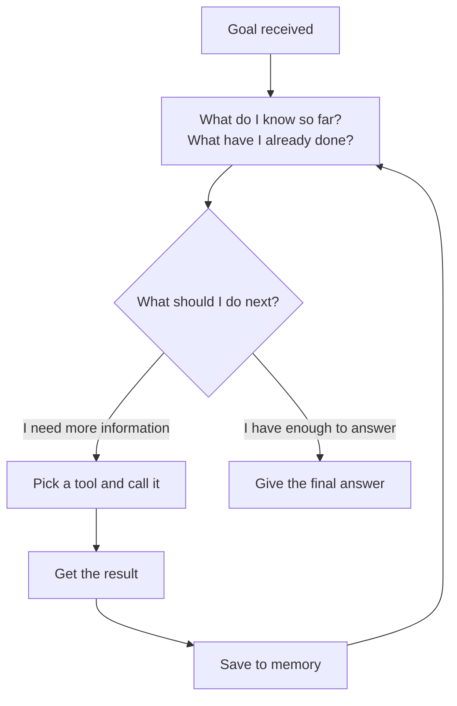

# Agents — LLM + Memory + Tools + Planning Loop

---

## Learning Objectives

By the end of this file you will be able to:

- Explain what an AI agent is and how it is different from a regular AI chat
- Name the four things every agent is made of and say what each one does
- Trace what happens inside an agent from the moment it gets a task to the moment it finishes
- Explain why some tasks need an agent and others do not

---

## The Decision You Keep Putting Off

You need to buy something — headphones, a phone, a laptop, anything. You check one review. It recommends something. You check another. It recommends something different and explains why the first recommendation is outdated. You go to a shopping site to compare prices. The prices are different from what the reviews mentioned. You check if there are newer models. There are. Now you are reading about those. One of them looks perfect but you are not sure if it is available in your country. You check. It is, but only on one site and the reviews there are mixed.

An hour later you have not bought anything and you are more confused than when you started.

You did all the work — deciding what to check next, reading and comparing, figuring out what was still unclear, and going back for more. And you still did not get to a decision.

Now imagine something that could do all of that for you. Not just answer one question — but actually go through the reviews, compare the options, check availability and current prices, notice the things that matter for your situation, and come back with a clear recommendation. All without you managing every step.

That is an AI agent.

Not a chatbot that answers from memory. Not a search engine that gives you links to read yourself. Something that works the way you work when you are genuinely trying to figure something out — except it does it faster, does not get distracted, and comes back with an actual answer.

---

## What Makes an Agent Different

You have used AI models before. You type something, the model replies. Simple.

But notice what is happening: **you** are the one deciding what to ask next. **You** read the answer, figure out what is still missing, and decide the next question. The model just responds — it does not take initiative.

An agent flips this. You give it a goal — not a question, a goal — and it figures out the steps on its own. It decides what to look up. It looks it up. It reads what came back. It decides what to do next based on what it found. It keeps going until the job is done.

The difference sounds small. It is actually enormous.

Think about what that means in practice. A model can tell you what command to run to check your Python version. An agent can check it itself, see that you have the wrong version, find the right download link for your operating system, and tell you exactly what to do — in one go, without you asking four follow-up questions.

---

## What Every Agent Is Made Of

Here is the thing about agents: no matter what framework, language, or model is used to build one — they all have exactly the same four parts. Once you understand these four parts, you can look at any agent in the world and immediately understand how it works.

### The Language Model — the part that thinks

The language model is the reasoning engine. It reads the current situation — the goal, what has already happened, what tools are available — and decides what to do next.

Here is the important part: **it only produces text**. It does not search the web. It does not run code. It does not check anything. It reads the situation and writes down what should happen next — like instructions. Something else reads those instructions and actually carries them out.

You can think of it as the part that thinks, but cannot act on its own.

### Memory — the part that remembers

Every time the agent does something — finds information, runs a calculation, gets a result — it needs to hold on to that result. Otherwise the next step starts fresh with no idea what just happened.

There are two kinds of memory an agent can use:

**In-context memory** — everything sitting in the current conversation. Fast and immediate, but there is a limit to how much fits, and it disappears when the session ends. Think of it like a whiteboard — great for active work, gone when you leave the room.

**External memory** — stored somewhere outside the conversation, in a database or a file. Slower to retrieve, but it can hold a lot more and it sticks around. Think of it like notes saved to disk.

Simple agents only use in-context memory. More complex agents pull from external memory when they need information from previous sessions.

### Tools — the part that acts

If the language model only produces text, how does anything actually happen?

Tools. A tool is a function the agent can call to interact with the real world. Searching the internet. Reading a file. Running code. Sending a message. These are all tools.

Each tool has a name and a description written in plain English — because the language model reads that description to understand when and why to use it. When the model decides to use a tool, it produces a structured instruction: "call this tool, with these inputs." The agent framework reads that instruction, runs the actual function, and hands the result back.

The language model never directly touches the tool. It just says what should be called. The framework does the calling.

Some common tools:

| Tool | What it does |
|---|---|
| `search_web` | Searches the internet and returns results |
| `read_file` | Opens a file and returns its contents |
| `run_code` | Executes code and returns the output |
| `call_api` | Makes a web request and returns the response |
| `query_database` | Runs a query and returns matching data |

### The Planning Loop — the part that keeps it going

This is the piece that turns the other three into something useful.

The planning loop is exactly what it sounds like — a loop that runs over and over. Each time around:



The loop runs until the agent either has enough to answer, or hits a maximum number of steps. That ceiling matters — without it, a confused agent can loop forever.

This is the single most important thing to understand about agents: **the loop**. A regular LLM call runs once. An agent runs the loop as many times as the task needs — and each trip around the loop uses what it found last time to decide what to do next.

---

## Watching It Work — Step by Step

Let us watch an agent work through something every student faces.

**Goal:** "I have ₹55,000 to spend on a laptop for programming. What should I buy right now?"

The agent has one tool: `search_web`.

---

**First time around the loop**

The agent reads the goal and thinks: *I need to find laptops available in India right now within this budget. Training data will not help here — prices change constantly. I need to search.*

```
Tool: search_web
Input: "best programming laptop under 55000 rupees India 2025"
Result: Several options appear — Lenovo IdeaPad Slim 5, ASUS Vivobook 15,
        Acer Aspire 5, HP Pavilion 15. Prices ranging from ₹48,000 to ₹56,000.
```

Good start. Memory updated. But the agent is not done — it needs to check which of these are actually worth recommending for programming specifically. Loop again.

---

**Second time around the loop**

The agent thinks: *I have a list of options. But I need to know which ones are best for programming — RAM, processor, and whether they run Linux well matters here.*

```
Tool: search_web
Input: "Lenovo IdeaPad Slim 5 vs ASUS Vivobook programming performance RAM 2025"
Result: Lenovo IdeaPad Slim 5 (AMD Ryzen 5, 16GB RAM) gets strong reviews
        for development work. ASUS Vivobook has 8GB RAM at similar price —
        not ideal for running multiple tools simultaneously.
```

Clearer picture now. Memory updated. Loop again.

---

**Third time around the loop**

The agent thinks: *I have a strong candidate. Let me quickly verify the current price is actually within budget and it is in stock.*

```
Tool: search_web
Input: "Lenovo IdeaPad Slim 5 AMD Ryzen 5 16GB RAM price India stock 2025"
Result: Available on Flipkart and Amazon India. Current price: ₹52,499.
        In stock. 4.3 stars, 1,200+ reviews.
```

Within budget. In stock. Verified. Memory updated. Loop again.

---

**Fourth time around the loop**

The agent reads everything it has gathered and thinks: *I have a clear recommendation with current price, verified availability, and the reasoning to back it up. I can answer now.*

```
Final answer:
"Within your ₹55,000 budget for programming, the Lenovo IdeaPad Slim 5 
(AMD Ryzen 5, 16GB RAM) is currently your best option.

Current price: ₹52,499 on Flipkart and Amazon India — in stock.

Why this one: 16GB RAM means you can run VS Code, a browser with 
multiple tabs, and a local server simultaneously without slowdown. 
The Ryzen 5 handles compilation and data processing well. Other options 
in this range mostly come with 8GB RAM, which becomes a bottleneck fast 
when you start working on larger projects."
```

Done. Four loops. Three searches. A specific, verified, reasoned answer — with current prices, current availability, and a clear explanation.

Compare this to what a regular AI would say: "I would recommend looking at the Dell Inspiron or Lenovo IdeaPad range for your budget." Vague. Based on old training data. No current prices. No availability check. No reasoning specific to your situation. The agent actually went and found out. The regular AI guessed.

---

## Not Everything Needs an Agent

Here is something important: agents are not always the right tool. They are slower, more expensive, and more complex than a direct LLM call. Use them only when the task actually needs them.

A task needs an agent when:
- The answer requires going and finding real, current information — not something the model already knows
- The task has multiple steps where each step depends on what the previous one found
- You cannot know the steps in advance — the path changes based on what is discovered

A task does not need an agent when:
- One prompt and one response is enough
- The model already has the information it needs in its training data
- The steps are always the same — a fixed pipeline works better and is easier to control

**Quick examples:**

| Task | Agent needed? | Why |
|---|---|---|
| "Explain what a linked list is" | No | Model already knows this |
| "Find me 3 internship openings in Bangalore for ML roles posted this week" | Yes | Requires live data |
| "Summarise this paragraph I am pasting" | No | One step, no external information needed |
| "Debug why my code is failing and fix it" | Yes | Steps depend on what the error actually is |
| "Write a function that reverses a string" | No | Does not require any external information |

---

## Best Practices

- Give the agent the **minimum tools it needs** — every extra tool is another decision the agent has to make, and another place it can go wrong
- Write tool descriptions **clearly** — the language model reads them to decide when to use each tool; a vague description leads to wrong choices
- Always define **when the task is done** — without this, the agent does not know when to stop
- Set a **maximum number of loop iterations** — your safety net for when things go sideways

## Common Beginner Mistakes

- **Thinking the model runs the tools** — it does not. It writes an instruction saying which tool to call. The framework does the actual calling. The model only ever produces text
- **Using an agent for everything** — a direct LLM call is faster, cheaper, and easier to debug. Only use an agent when the task genuinely needs one
- **No maximum iterations** — an agent with no ceiling can loop indefinitely if it gets confused. Always set one

---

## Key Takeaways

- An agent is an AI system that receives a goal and figures out the steps — searching for information, running tools, observing results — until the job is done
- Every agent has exactly four parts: a **language model** (thinks and decides), **memory** (holds what has happened so far), **tools** (the only way to act on the world), and a **planning loop** (runs everything in a cycle)
- The language model never directly runs a tool — it produces an instruction, the framework executes it
- The planning loop is what separates an agent from a one-shot LLM call — it runs as many times as needed, using each result to shape the next step
- Not every task needs an agent — use one only when the answer requires going and finding real information, or when the steps depend on what is discovered along the way

> **Interview tip:** If asked "what is an AI agent?" — name the four parts, describe the planning loop in one sentence, and give a concrete example of why a regular LLM call would fail at the same task. Most people say "it is AI that can take actions." Naming all four parts and explaining the loop is what shows you actually understand how one works.

---

## Reference Links

- 📎 [Building Effective Agents — Anthropic Research](https://www.anthropic.com/research/building-effective-agents)
- 📎 [ReAct — Synergizing Reasoning and Acting in Language Models](https://arxiv.org/abs/2210.03629)
- 📎 [LangChain — Agents Conceptual Guide](https://python.langchain.com/docs/concepts/agents/)
