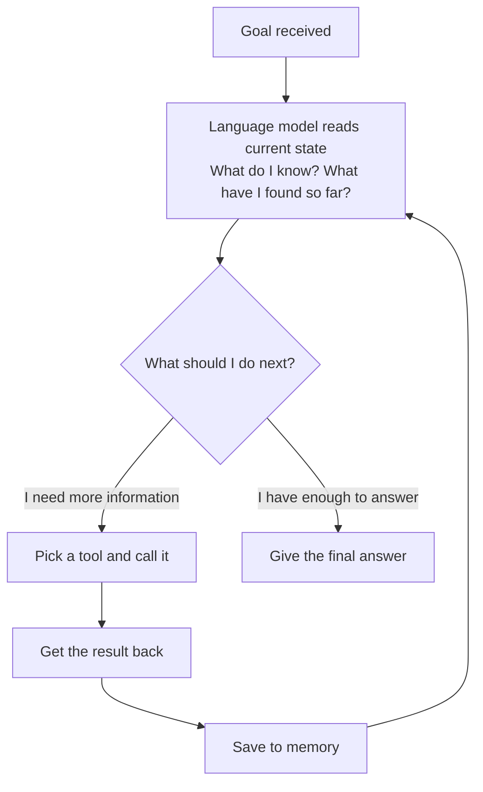

# Agents — LLM + Memory + Tools + Planning Loop

---

## Learning Objectives

By the end of this file you will be able to:

- Explain what an AI agent is and how it is different from a regular AI chat
- Name the four things every agent is made of and say what each one does
- Trace what happens inside an agent from the moment it gets a task to the moment it finishes
- Explain why some tasks need an agent and others do not

---

## The Decision You Keep Putting Off

You need to buy a laptop. You have a budget. You want something good for programming.

You check one review. It recommends something. You check another — it recommends something different and says the first option has a heating issue. You go to a shopping site to check prices. The prices are different from what the reviews mentioned. You check if there is a newer model. There is. Now you are reading about that one. It looks good but you are not sure if it fits your budget after taxes and delivery. You check. It does, barely. But now you are second-guessing yourself — is 8GB RAM enough or should you stretch the budget for 16GB?

An hour later you have eleven tabs open, no decision made, and you are more confused than when you started.

You did all the work — deciding what to check next, reading and comparing, figuring out what was still unclear, going back for more. And you still did not land on an answer.

Now imagine something that could do all of that for you. Not just answer one question — but actually go through the reviews, compare the options, check current prices and availability, weigh up what matters for your use case, and come back with a clear, reasoned recommendation.

That is an AI agent. And the rest of this file explains exactly how it works.

---

## What an Agent Actually Is

Here is the simplest definition:

> **An agent is an AI system that can use tools to take actions in the world, and decides for itself what actions to take — step by step — until a task is complete.**

With the laptop example: you give the agent a goal — *"I have ₹55,000. I need a laptop for programming. What should I buy right now?"* — and it figures out the steps on its own. It decides what to search first. It searches. It reads what came back. It decides what is still missing. It searches again. It keeps going until it has enough to give you a real, specific answer.

The key word is **decides**. The agent is not following a script you wrote. It is figuring out the next step as it goes — based on what it just found.

Compare that to a regular AI model. You ask it the same question and it will say something like: *"I would recommend looking at the Lenovo IdeaPad or HP Pavilion range for your budget."* That came from training data — old information, no current prices, no stock check, no comparison of what is actually available today. It guessed. The agent goes and finds out.

---

## The Four Things Every Agent Is Made Of

Every agent — no matter what framework or model it is built on — has exactly four parts. Let us go through each one using the laptop example so you can see what each part is actually doing.

---

### 1. The Language Model — The Part That Thinks

The language model is the reasoning engine. It reads the current situation — the goal, what has already been found, what tools are available — and decides what to do next.

In the laptop task, this is the part that looks at your ₹55,000 budget and thinks: *"I need current prices. I cannot rely on what I know from training — laptop prices change constantly. I should search."* Then, after getting search results, it thinks: *"I have some options. But I need to compare them on specs relevant to programming — RAM, processor, whether they run well under load."* Then after that: *"I have a strong candidate. Let me verify the price is still within budget."*

That thinking — deciding what matters, what is still missing, what to do next — is the language model's job.

Here is the critical thing to understand: **the language model only produces text**. It does not search the web. It does not open any page. It does not check any price. It reads the situation and writes down what should happen next. Something else — the agent framework — reads those instructions and actually carries them out.

Think of it as the part that thinks but cannot act on its own.

---

### 2. Memory — The Part That Remembers

Every time the agent finds something — a price, a spec comparison, a stock status — it needs to hold on to that information. Otherwise the next step starts completely fresh with no idea what was just found.

In the laptop task, after the first search the agent finds several options: Lenovo IdeaPad Slim 5, ASUS Vivobook, Acer Aspire 5. It needs to remember these so the next search can compare them — not just find them again from scratch.

There are two kinds of memory:

**In-context memory** is everything sitting in the current conversation — fast and immediately available, but limited in size and gone when the session ends. Think of it like a whiteboard. Great for active work. Gone when you leave the room.

**External memory** is stored somewhere outside the conversation — a database, a file, a vector store. It can hold much more and it persists across sessions. Think of it like saving your research notes to a document so you can come back to it tomorrow.

For the laptop task, in-context memory is enough — the agent just needs to remember what it found in this session. For more complex agents that need to remember things across multiple days or conversations, external memory becomes important.

---

### 3. Tools — The Part That Acts

The language model can think all it wants — but thinking alone does not search the web or check a price. That is what tools are for.

A tool is a function the agent can call to actually do something in the world. In the laptop task, the only tool needed is `search_web` — the ability to search the internet and get results back.

Each tool has three things:
- A **name** — what the agent calls it
- A **description** in plain English — so the language model knows when and why to use it
- A **schema** — what inputs it takes and what it returns

When the language model decides to search, it produces a structured instruction: *"call search_web with this query."* The agent framework reads that, runs the actual search, and hands the result back to the language model. The language model never directly touches the internet — it just says what should be searched. The framework does the actual searching.

Here are some common tools across different types of agents:

| Tool | What it does |
|---|---|
| `search_web` | Searches the internet and returns results |
| `read_file` | Opens a file and returns its contents |
| `run_code` | Executes code and returns the output |
| `call_api` | Makes a web request and returns the response |
| `query_database` | Runs a query and returns matching data |

For the laptop task, `search_web` is the only tool needed. More complex tasks need more tools — but the principle is exactly the same.

---

### 4. The Planning Loop — The Part That Keeps It Going

This is the engine that ties the other three together.



In the laptop task this loop runs four times:
- First loop: search for laptops in budget → find options → save them
- Second loop: compare those options on specs relevant to programming → find the strongest candidate → save it
- Third loop: verify current price and stock → confirm it is within budget → save it
- Fourth loop: decide there is enough to answer → produce the recommendation

Each loop uses what the previous loop found. The second search is smarter than the first because the agent already knows which options exist. The third search is targeted because the agent already knows which one to verify.

This is what makes an agent different from a regular LLM call. A regular call happens once — one question, one answer. An agent loops as many times as the task needs, and each loop builds on the last.

---

## The Full Example — Start to Finish

Now let us watch the entire laptop task run from goal to final answer.

**Goal:** *"I have ₹55,000 to spend on a laptop for programming. What should I buy right now?"*

The agent has one tool: `search_web`.

---

**Loop 1 — Find the options**

*Language model thinks:* "I need current options. Prices change — I cannot rely on training data. I will search."

```
Tool: search_web
Query: "best programming laptop under 55000 rupees 2025"
Result: Several options appear — Lenovo IdeaPad Slim 5, ASUS Vivobook 15,
        Acer Aspire 5. Prices ranging from ₹46,000 to ₹56,000.
```

*Saved to memory. Loop again.*

---

**Loop 2 — Compare what matters for programming**

*Language model thinks:* "I have a list. But which of these is actually good for programming? RAM and processor matter most — I need to compare those specifically."

```
Tool: search_web
Query: "Lenovo IdeaPad Slim 5 vs ASUS Vivobook 15 programming RAM processor 2025"
Result: Lenovo IdeaPad Slim 5 (Ryzen 5, 16GB RAM) gets strong marks for
        development work. ASUS Vivobook comes with 8GB RAM at a similar
        price — limiting when running multiple tools simultaneously.
```

*Lenovo IdeaPad Slim 5 is the stronger candidate. Saved to memory. Loop again.*

---

**Loop 3 — Verify price and availability**

*Language model thinks:* "I have a recommendation but I need to confirm the actual current price is within budget and it is in stock. Reviews sometimes use prices that are months old."

```
Tool: search_web
Query: "Lenovo IdeaPad Slim 5 Ryzen 5 16GB price India stock 2025"
Result: Available on major shopping sites. Current price: ₹52,499. In stock.
        4.3 stars across 1,200+ reviews.
```

*Within budget. In stock. Confirmed. Saved to memory. Loop again.*

---

**Loop 4 — Enough to answer**

*Language model thinks:* "I have current options, a comparison on what matters for programming, and a verified price. I can answer now."

```
Final answer:
"For ₹55,000 and programming work, get the Lenovo IdeaPad Slim 5 
(Ryzen 5, 16GB RAM).

Current price: ₹52,499 — in stock on major shopping sites.

Why this one over the others: 16GB RAM means you can run your 
code editor, a browser with multiple tabs, and a local server 
at the same time without slowdown. The other options in this 
price range mostly come with 8GB, which becomes a bottleneck 
quickly once your projects grow."
```

---

Compare this to what a regular AI would give you: *"I would recommend looking at the Lenovo IdeaPad or HP Pavilion range for your budget."*

Vague. No current prices. No stock check. No reasoning about what matters for programming specifically. The regular AI answered from memory — from training data that could be a year old. The agent went and found out.

---

## When Do You Actually Need an Agent?

Not every task needs an agent. Agents are slower, more expensive, and more complex than a direct AI call. The laptop task needed an agent because the answer required current information that changes daily. A lot of tasks do not need that.

| Use a direct AI call when... | Use an agent when... |
|---|---|
| The answer does not change — the AI already knows it | The answer requires current, live information |
| One step is enough | Multiple steps are needed and each depends on the previous |
| The path is always the same | The path depends on what is found along the way |
| Speed and cost matter most | Getting the right answer matters most |

**Does not need an agent:**
- "Explain what RAM is" — the AI already knows this
- "Write a function that sorts a list" — no external information needed
- "Summarise this paragraph" — one step, done

**Needs an agent:**
- "What laptop should I buy for ₹55,000 right now?" — current prices, current stock
- "Find me three good open source projects to contribute to this week" — requires live data
- "What is the weather forecast for my city this weekend?" — changes daily

---

## Best Practices

- Give the agent the **minimum tools it needs** — in the laptop task, one search tool was enough. Every extra tool is another decision point and another place things can go wrong
- Write tool descriptions **clearly** — the language model reads them to decide when to use each tool. A vague description leads to wrong choices
- Always define **when the task is done** — without a clear stopping condition the agent does not know when to stop looping
- Set a **maximum number of loop iterations** — your safety net. If something goes wrong, the loop stops here instead of running forever

## Common Beginner Mistakes

- **Thinking the language model runs the tools** — it does not. It produces an instruction saying which tool to call. The framework executes it. The language model only ever produces text
- **Using an agent for everything** — a direct AI call is faster and cheaper. Only reach for an agent when the task genuinely needs current information or multi-step reasoning
- **No maximum iterations** — an agent with no ceiling can loop indefinitely if it gets confused. Always set one

---

## Key Takeaways

- An agent receives a goal and figures out the steps — searching, checking, comparing, deciding what is still missing — until it has a complete, verified answer
- Every agent has four parts: a **language model** (decides what to do next), **memory** (holds what has been found so far), **tools** (the only way to act on the world), and a **planning loop** (runs everything in a cycle, building on each previous result)
- The language model never directly runs a tool — it produces an instruction, the framework executes it
- Each loop builds on the previous one — the second search is smarter because the first search already happened
- Not every task needs an agent — use one only when the answer requires current information or when the steps depend on what is discovered along the way

> **Interview tip:** If asked "what is an AI agent?" — use a concrete example to explain it. Describe a task where a regular AI call would give a vague or outdated answer, then explain how an agent would handle it — searching, reading, deciding what is still missing, searching again. Name the four parts. Explain the loop in one sentence. Most people describe agents vaguely. Grounding your explanation in a specific example with the four parts named is what stands out.

---

## Reference Links

- 📎 [Building Effective Agents — Anthropic Research](https://www.anthropic.com/research/building-effective-agents)
- 📎 [ReAct — Synergizing Reasoning and Acting in Language Models](https://arxiv.org/abs/2210.03629)
- 📎 [LangChain — Agents Conceptual Guide](https://python.langchain.com/docs/concepts/agents/)
