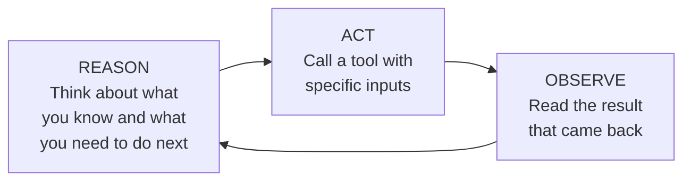

# The ReAct Pattern — Reason, Act, Observe, Reason Again

---

## Learning Objectives

By the end of this file you will be able to:

- Explain what the ReAct pattern is and why it exists
- Trace the Reason → Act → Observe cycle step by step
- Identify what the agent is doing at each stage of the loop
- Explain why reasoning before acting produces better results than acting directly

---

## Start Here — Why Does the Agent Need a Pattern?

In the previous file you saw that an agent loops — it takes a step, observes the result, decides the next step, and keeps going. But here is a question: how does the agent decide what to do next?

It could just pick a tool and call it. But that leads to bad decisions. The agent might call the wrong tool, pass the wrong inputs, or call a tool when it already has enough information to answer.

The ReAct pattern solves this by giving the agent a structured way to think before it acts. Instead of jumping straight to a tool call, the agent first reasons out loud — "here is what I know, here is what I still need, here is what I am going to do next and why." Then it acts. Then it reads what came back. Then it reasons again.

**Reason → Act → Observe. Repeat.**

That is ReAct.

---

## What ReAct Stands For

ReAct stands for **Reasoning and Acting**. It was introduced in a 2022 research paper that showed a simple finding: agents that reason before acting make significantly fewer mistakes than agents that act directly.

The insight is obvious once you see it. Humans do this naturally. Before you call a plumber you think: "the pipe is leaking under the sink, I need someone who handles residential plumbing, I should check if they are available today." You do not just dial a random number. You reason first, then act.

ReAct gives agents the same discipline.

---

## The Three Stages

Every iteration of the ReAct loop has three stages.



### Stage 1 — Reason

The agent produces a thought. This is not the final answer — it is the agent thinking through its current situation out loud.

A good thought answers three questions:
- What do I know so far?
- What do I still need?
- What am I going to do next and why?

This thought is not shown to the user. It is internal reasoning — the agent working out its next move before committing to it.

### Stage 2 — Act

After reasoning, the agent calls a specific tool with specific inputs. The action is always grounded in the preceding thought — the reasoning explains why this tool, with these inputs, right now.

### Stage 3 — Observe

The tool runs and returns a result. The agent reads this result — the observation. This observation becomes part of the agent's memory and feeds directly into the next round of reasoning.

Then the cycle repeats: reason, act, observe, reason, act, observe — until the agent decides it has enough to produce a final answer.

---

## Worked Example — Checking if a College Has a Good Placement Record

A student is deciding whether to apply for an internship at a company that recently hired from her college. She asks an agent:

> "Does Infosys have a good placement record at PES University Bangalore for CS students? What were the average packages offered in the last two years?"

---

**Iteration 1**

*Reason:*
> "I need placement data for Infosys at PES University. This is specific, recent information that I won't have reliably in training. I should search for it."

*Act:*
```
search_web("Infosys placement PES University Bangalore CS 2023 2024 package")
```

*Observe:*
```
"PES University Bangalore placements 2024 — Infosys offered roles to
42 CS students. Average package: ₹4.5 LPA. Highest: ₹6.8 LPA."
```

---

**Iteration 2**

*Reason:*
> "I have 2024 data. I also need 2023 data to show a trend over two years."

*Act:*
```
search_web("Infosys placement PES University Bangalore CS 2023 package")
```

*Observe:*
```
"PES University 2023 placements — Infosys recruited 38 CS students.
Average package: ₹4.2 LPA."
```

---

**Iteration 3**

*Reason:*
> "I now have data for both years. 2023: 38 students at ₹4.2 LPA average. 2024: 42 students at ₹4.5 LPA average. The number of hires and the average package both went up. I have enough to answer."

*Final answer:*
```
"Infosys has a consistent placement record at PES University for CS 
students. In 2023 they hired 38 students at an average of ₹4.2 LPA, 
and in 2024 they hired 42 students at an average of ₹4.5 LPA — both 
the hiring numbers and the package went up year on year."
```

---

Notice the reasoning stage in each iteration. The agent did not just fire off a search randomly — it explained what it knew, what was missing, and why the next search was the right move. In Iteration 2 it specifically identified that one year of data is not enough to show a trend. That kind of structured thinking is what ReAct produces.

---

## What Happens Without Reasoning

Here is the same task without the reasoning stage — the agent just acts directly:

**Iteration 1:**
```
search_web("Infosys PES University packages")
```
Result comes back with 2024 data only.

**Iteration 2:**
The agent sees it has some data and produces a final answer based on only one year.

The answer is technically accurate but incomplete — the user asked about two years and the agent answered with one. Without the reasoning stage the agent did not notice the gap.

This is the core value of ReAct: **reasoning surfaces what is still missing before the agent commits to an action or an answer.**

---

## ReAct in Practice — What It Looks Like in Code

When you build agents using a framework, the ReAct loop is usually handled for you. But it helps to understand what the model is actually producing at each step.

A typical ReAct prompt structure instructs the model to always output in this format:

```
Thought: [the agent's reasoning about the current situation]
Action: [the tool to call]
Action Input: [the inputs to pass to the tool]
```

After the tool runs, the framework appends:

```
Observation: [the result returned by the tool]
```

And then the model produces another `Thought:` — starting the next iteration.

When the agent is ready to answer it produces:

```
Thought: I now have everything I need to answer the question.
Final Answer: [the response to the user]
```

You will see this exact structure when you inspect agent logs in frameworks like LangChain, LlamaIndex, or when building agents directly with an API.

---

## When ReAct Helps Most

ReAct is particularly valuable for tasks where:

- **Multiple pieces of information must be combined** — the agent needs to gather several things before it can answer, and reasoning helps it track what it has and what is missing
- **Results from one step determine the next step** — the agent cannot know in advance what to search for next until it sees what the first search returned
- **The task is ambiguous** — reasoning helps the agent clarify what is actually being asked before acting

For simple, single-step tasks, the ReAct overhead adds little value. The pattern is most powerful for complex, multi-step tasks with uncertain paths.

---

## Best Practices

- When designing agent prompts, explicitly instruct the model to reason before acting — do not assume it will do this naturally
- Read the agent's thought logs when debugging — the reasoning stage tells you exactly why the agent made each decision, which makes it much easier to find where it went wrong
- If an agent keeps making poor tool choices, the problem is usually in the reasoning stage — the thought does not correctly identify what is missing

## Common Beginner Mistakes

- **Skipping the reasoning stage to save tokens** — this makes the agent faster and cheaper but significantly increases errors, especially on multi-step tasks
- **Treating the thought as the answer** — the thought is internal reasoning, not the final response. Frameworks handle this distinction, but if you are building from scratch, be careful not to expose intermediate thoughts to the user as if they were answers
- **Not reading the observation carefully** — the reasoning in the next step is only as good as how carefully the previous observation was read. If the agent glosses over the observation, it misses information that would change its next decision

---

## Key Takeaways

- ReAct stands for Reasoning and Acting — it is the pattern that gives agents a structured way to think before they act
- Every iteration has three stages: **Reason** (think through what you know and what you need), **Act** (call a specific tool), **Observe** (read the result)
- Reasoning before acting surfaces gaps — things the agent does not yet have — before it commits to an action or a final answer
- Without the reasoning stage agents act on incomplete information and miss gaps they would have noticed if they had stopped to think first
- In agent frameworks, the Thought/Action/Observation structure is usually visible in logs — reading it is the primary way to debug agent behaviour

> **Interview tip:** If asked "how does a ReAct agent work?" — walk through one iteration of the loop: the agent reasons about what it knows and what it needs, calls a tool based on that reasoning, reads the observation, and feeds it into the next round of reasoning. Then explain why reasoning before acting matters — it surfaces gaps before the agent commits to an action. Most people just say "it reasons and acts" without explaining what the reasoning actually does. Showing you understand why the pattern exists is what stands out.

---

## Reference Links

- 📎 [ReAct — Original Paper (Yao et al., 2022)](https://arxiv.org/abs/2210.03629)
- 📎 [LangChain — ReAct Agent](https://python.langchain.com/docs/concepts/agents/#react-agents)
- 📎 [Building Effective Agents — Research Overview](https://www.anthropic.com/research/building-effective-agents)
